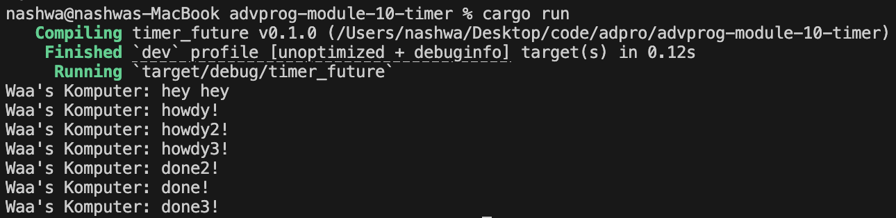
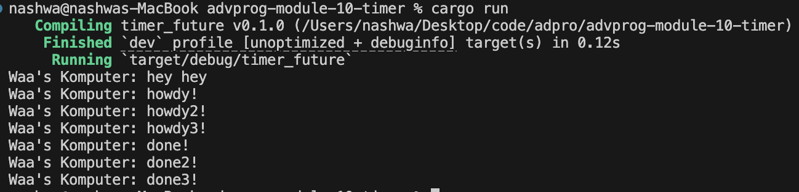
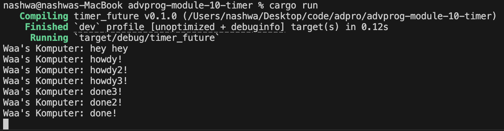

Pemrograman Lanjut (Advanced Programming) 2024/2025 Genap

- Nama : Nashwa Ghania
- NPM : 2306241770
- Kelas : Pemrograman Lanjut - A

### Reflection:
#### 1.2 Understanding how it works

Fungsi main() pada dasarnya membuat executor dan spawner terlebih dahulu. Setelah itu, spawner.spawn digunakan untuk menjalankan sebuah tugas asinkron yang akan mencetak "howdy!", menunggu selama 2 detik menggunakan TimerFuture::new(Duration::new(2, 0)), lalu mencetak "done!". Di sisi lain, string "hey hey" langsung dicetak karena berada di luar konteks tugas asinkron yang dijalankan oleh spawn.

Walaupun baris println!("hey hey") berada setelah pemanggilan spawner.spawn(...), hasil cetaknya muncul lebih dulu. Hal ini terjadi karena fungsi async berjalan di luar alur utama eksekusi. Artinya, program utama tidak akan menunggu tugas async selesai, melainkan langsung mengeksekusi baris kode berikutnya. Sementara itu, TimerFuture bekerja dengan membuat thread terpisah yang tidur selama durasi yang ditentukan, lalu mengubah status internalnya menjadi "selesai". Setelah selesai, thread ini akan memberi tahu tugas async agar bisa dilanjutkan kembali menggunakan waker.

Output seperti ini mencerminkan cara kerja sistem asynchronous: tugas utama tidak diblokir oleh tugas lainnya, sehingga program bisa terus berjalan dan mencetak "hey hey" lebih dulu, sedangkan tugas async akan mencetak "howdy!" dan "done!" setelah delay-nya selesai.

#### 1.3 Multiple Spawn and Removing Drop

Ketika menggunakan drop(spawner), program akan memberikan sinyal kepada eksekutor bahwa tidak ada lagi tugas baru yang akan ditambahkan. Akibatnya, eksekutor langsung mulai menjalankan semua tugas yang sudah di-spawn. Pada hasil yang terlihat, pesan "hey hey" tetap muncul paling awal, kemudian diikuti oleh kumpulan pesan "howdy" yang dicetak hampir bersamaan karena semua tugas berjalan secara paralel. Setelah menunggu selama 2 detik menggunakan TimerFuture, masing-masing tugas menyelesaikan eksekusinya dan mencetak pesan "done", "done2", dan "done3" sesuai urutan selesai. Jadi, meskipun semua tugas dimulai bersamaan, pesan "done" baru muncul setelah seluruh tugas selesai menunggu secara paralel.
 
 

Sebaliknya, ketika drop(spawner) dihilangkan, spawner tetap aktif dan terus menerima penambahan tugas baru tanpa henti. Output yang dihasilkan masih menunjukkan pesan "hey hey" pertama kali, lalu diikuti oleh pesan "howdy", "howdy2", "howdy3", dan seterusnya yang muncul hampir bersamaan karena semua tugas berjalan paralel tanpa batasan. Setelah menunggu 2 detik, semua tugas akan menyelesaikan dan mencetak pesan "done", "done2", dan "done3" secara bersamaan. Tanpa drop(spawner), eksekusi asinkron berlangsung terus menerus tanpa ada sinyal berhenti, sehingga semua pesan tersebut tercetak hampir bersamaan dan program tetap berjalan menunggu tugas baru.