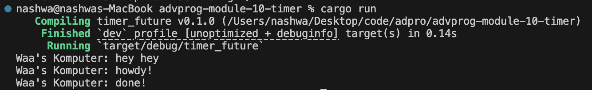

Pemrograman Lanjut (Advanced Programming) 2024/2025 Genap

- Nama : Nashwa Ghania
- NPM : 2306241770
- Kelas : Pemrograman Lanjut - A

### Reflection:
## 1.2 Understanding how it works

Fungsi main() pada dasarnya membuat executor dan spawner terlebih dahulu. Setelah itu, spawner.spawn digunakan untuk menjalankan sebuah tugas asinkron yang akan mencetak "howdy!", menunggu selama 2 detik menggunakan TimerFuture::new(Duration::new(2, 0)), lalu mencetak "done!". Di sisi lain, string "hey hey" langsung dicetak karena berada di luar konteks tugas asinkron yang dijalankan oleh spawn.

Walaupun baris println!("hey hey") berada setelah pemanggilan spawner.spawn(...), hasil cetaknya muncul lebih dulu. Hal ini terjadi karena fungsi async berjalan di luar alur utama eksekusi. Artinya, program utama tidak akan menunggu tugas async selesai, melainkan langsung mengeksekusi baris kode berikutnya. Sementara itu, TimerFuture bekerja dengan membuat thread terpisah yang tidur selama durasi yang ditentukan, lalu mengubah status internalnya menjadi "selesai". Setelah selesai, thread ini akan memberi tahu tugas async agar bisa dilanjutkan kembali menggunakan waker.

Output seperti ini mencerminkan cara kerja sistem asynchronous: tugas utama tidak diblokir oleh tugas lainnya, sehingga program bisa terus berjalan dan mencetak "hey hey" lebih dulu, sedangkan tugas async akan mencetak "howdy!" dan "done!" setelah delay-nya selesai.